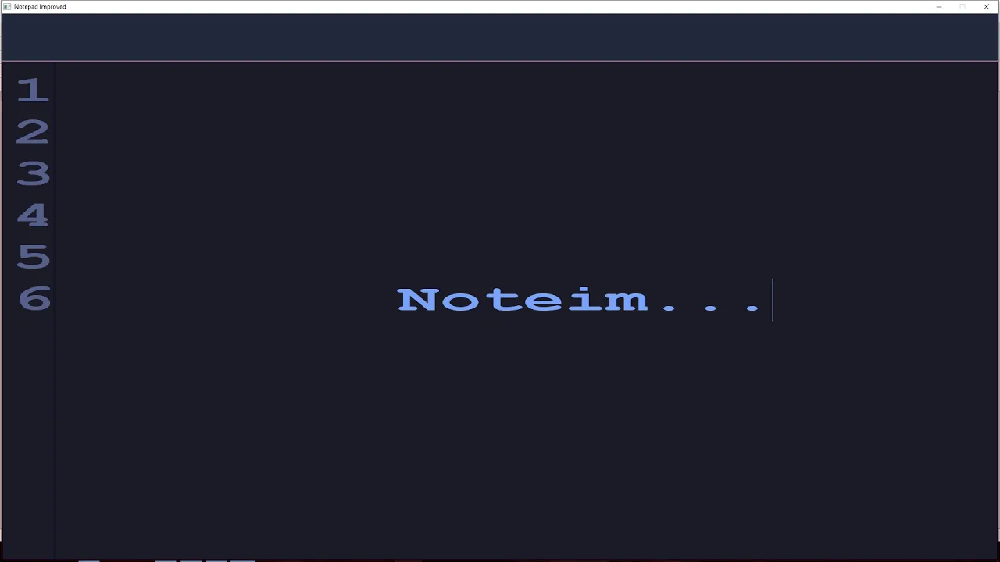

# Noteim

A minimalist text editor, which was developed during Introduction in Programming course
at UAIC, Faculty of Computer Science, by Frunza Alexandru and Butnaru Alexandru.

A video presentation of the project, in romanian, can be found there:

")

## Features

- Text manipulation (insert, delete, save)
- File creation
- In application clipboard, ability to copy, cut and paste text
- Ability to work with multiple windows
- Fast text manipulation (because of the [piece table](https://en.wikipedia.org/wiki/Piece_table)
data structure used for storing the text in memory)
- Ability to open very large files (tested with ~120MB file)
- Movement commands: jump to specific line, to the start/end of a line

## Requirements

- The application was developed and tested using CodeBlocks IDE, on Windows 10
- To compile the application the graphic library WinBGIm is needed, a guide in
romanian for installation can be found [there](https://profs.info.uaic.ro/~introp/curs2022-2023/lab5.html)

## Contributors

- Butnaru Alexandru - [Roice32](https://github.com/Roice32)
- Frunza Alexandru - [alexfrunza](https://github.com/alexfrunza)
